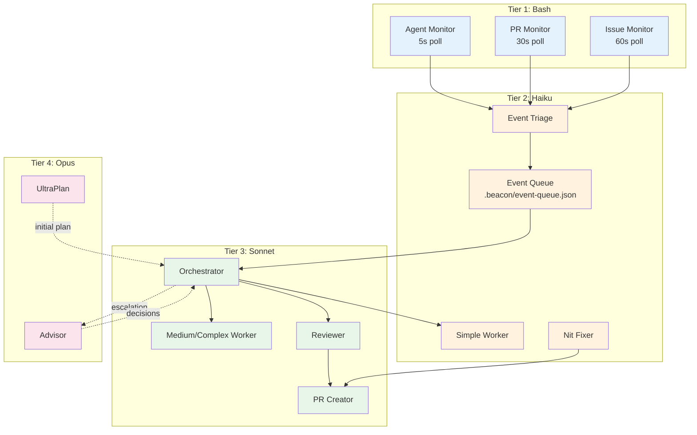
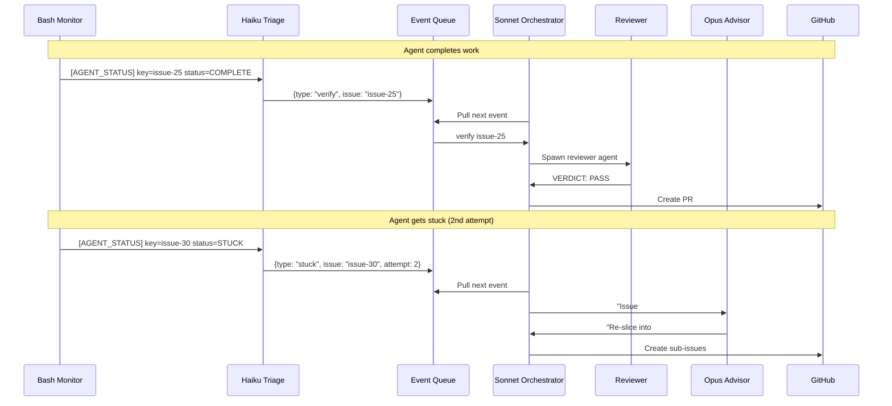
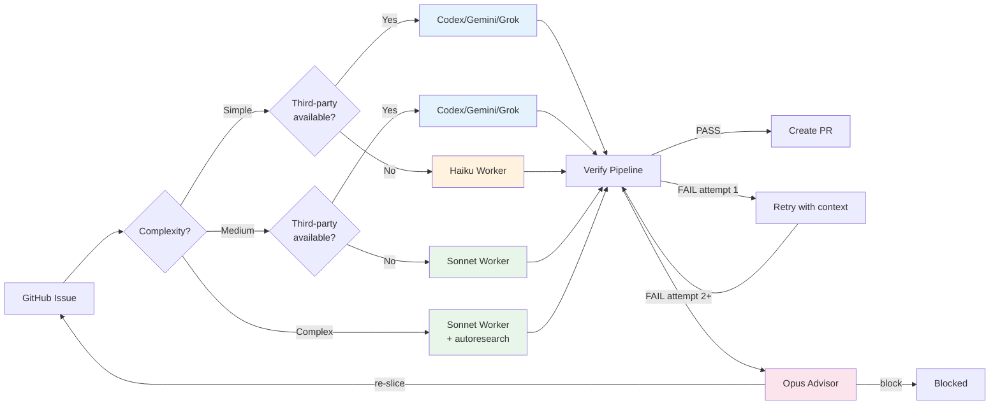
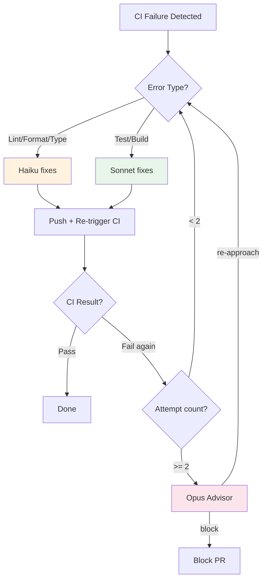

# Beacon

Autonomous multi-agent orchestration plugin for [Claude Code](https://docs.anthropic.com/en/docs/claude-code). Routes GitHub issues to AI CLI tools (Claude, Codex, Gemini, Grok), verifies results, and auto-merges approved work.

## Architecture

Beacon v3 uses an **Advisor + Monitor** pattern: Sonnet runs the event loop, Opus advises at strategic decision points, and Haiku handles lightweight triage.

### Four-Tier Model



### Event Flow



### Dispatch Strategy



### CI Autofix Loop



## Plugin Structure

```
beacon/
  .claude-plugin/plugin.json    # Plugin metadata
  skills/
    beacon/SKILL.md             # Core orchestration skill
    beacon-dispatch/SKILL.md    # Agent dispatch protocol
    beacon-verify/SKILL.md      # Verification pipeline
    beacon-status/SKILL.md      # Status display
    beacon-poll/SKILL.md        # GitHub issue sync
  commands/
    beacon.md                   # /beacon start|status|stop|plan|help
  agents/
    reviewer.md                 # Structured verification agent
    monitor.md                  # PR/CI monitoring agent
  hooks/
    beacon-init.sh              # Initialize .beacon/ workspace
    detect-tools.sh             # Detect available AI CLIs + quota
    update-state.sh             # State machine transitions + GitHub labels
    check-completion.sh         # Query tmux for dead panes
    cleanup-worktree.sh         # Remove worktree, branch, close issue
    sweep-stale.sh              # Clean up orphaned worktrees
```

## State Management

- **Local**: `.beacon/state.json` — issues, plan phases, tool quotas, stats
- **Durable**: GitHub labels (`beacon:in-progress`, `beacon:blocked`, `beacon:paused`, `beacon:done`) for cross-session recovery
- **Event queue**: `.beacon/event-queue.json` — Haiku writes, Sonnet reads

## Prerequisites

- [Claude Code](https://docs.anthropic.com/en/docs/claude-code) CLI
- `gh` (GitHub CLI, authenticated)
- `tmux` (for third-party agent dispatch)
- `jq` (JSON processing)
- Git repository with GitHub remote

## Usage

```bash
# Start autonomous orchestration
/beacon start

# Check status of all agents and issues
/beacon status

# View the current plan
/beacon plan

# Stop all agents gracefully
/beacon stop
```

## License

MIT
