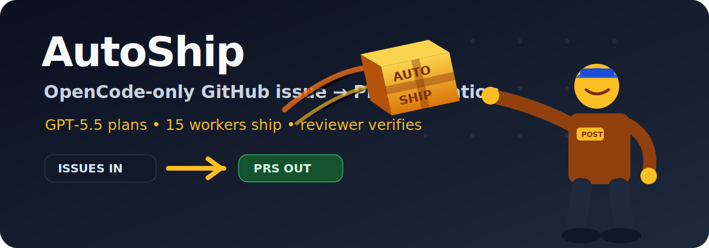
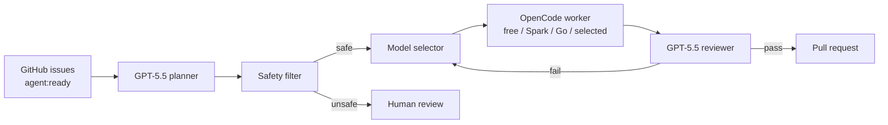
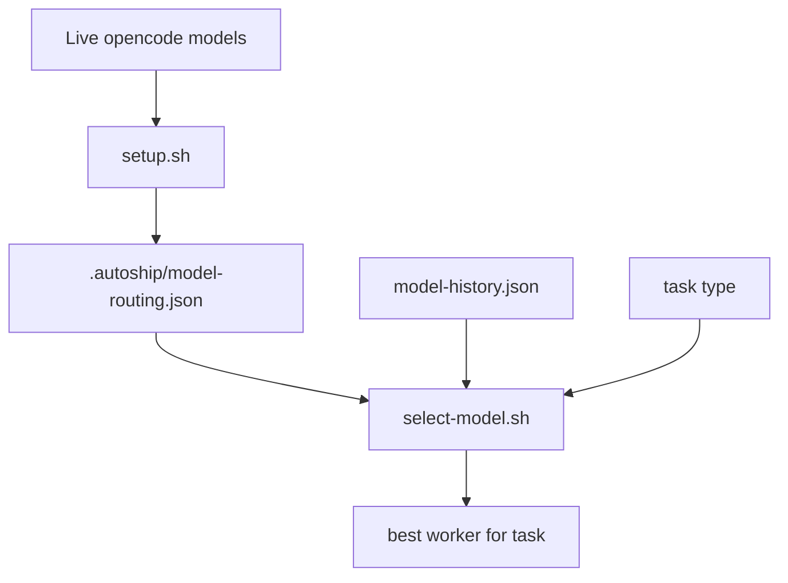

# AutoShip

<p align="center">
  
</p>

<p align="center">
  <a href="https://github.com/Maleick/AutoShip/stargazers"></a>
  <a href="https://github.com/Maleick/AutoShip/commits/main"></a>
  <a href="https://github.com/Maleick/AutoShip/releases"></a>
  <a href="LICENSE"></a>
  <a href="https://autoship.teamoperator.red"></a>
  <a href="https://github.com/sponsors/Maleick"></a>
</p>

<p align="center">
  <a href="https://autoship.teamoperator.red">Docs</a> •
  <a href="https://github.com/Maleick/AutoShip/wiki">Wiki</a> •
  <a href="#commands">Commands</a> •
  <a href="#runtime">Runtime</a> •
  <a href="#local-testing">Testing</a> •
  <a href="https://github.com/sponsors/Maleick">Sponsor</a>
</p>

<p align="center"><strong>Turn backlog into reviewed PRs.</strong></p>

AutoShip is the OpenCode plugin for solo maintainers who want their GitHub issue queue planned, routed, verified, and packaged into pull requests without babysitting every worker.

```text
┌──────────────────────────────────────────┐
│  ISSUE PLANNING        GPT-5.5           │
│  MODEL SELECTION       LIVE OPENCODE     │
│  WORKER DISPATCH       15 ACTIVE MAX     │
│  REVIEW                GPT-5.5           │
│  PR CREATION           CONVENTIONAL      │
└──────────────────────────────────────────┘
```

## What It Does

- Reads open GitHub issues labeled `agent:ready`
- Plans work in ascending issue-number order
- Blocks unsafe/evasion-prone issues for human review
- Dispatches OpenCode workers up to the configured concurrency cap
- Verifies completed work before PR creation
- Creates PRs with conventional commit titles
- Tracks local state in `.autoship/`

## Runtime

OpenCode is the only supported worker runtime. AutoShip discovers current model availability from:

```bash
opencode models
```

Setup defaults to currently available models flagged free. Operators can explicitly select a comma-separated model list with `AUTOSHIP_MODELS`.

The selected routing is saved to `.autoship/model-routing.json`. Edit that file manually to tune model eligibility, strength, or task types. Setup preserves manual edits by default; use `AUTOSHIP_REFRESH_MODELS=1 bash hooks/opencode/setup.sh` to regenerate from the current OpenCode inventory.

## Defaults

- Max active workers: `15`
- Queue ordering: lowest issue number first
- Model routing: free detected OpenCode models first
- Planner/coordinator/orchestrator/reviewer: `openai/gpt-5.5`
- Worker selection: best configured model per task, with free, Spark, Go-provider, and other selected models eligible when available
- Unsafe issue handling: block / human-required

## How It Works





## Commands

| Command | Purpose |
| --- | --- |
| `/autoship` | Start orchestration |
| `/autoship-plan` | Show ascending, safety-filtered issue plan |
| `/autoship-status` | Show runtime state and workspace statuses |
| `/autoship-setup` | Discover OpenCode models and choose routing |
| `/autoship-stop` | Stop orchestration |

## Key Hooks

| Hook | Purpose |
| --- | --- |
| `hooks/opencode/setup.sh` | Discover live OpenCode models and write `.autoship/model-routing.json` |
| `hooks/opencode/plan-issues.sh` | Build ascending, safety-filtered issue plan |
| `hooks/opencode/dispatch.sh` | Create worktree, prompt, model assignment, and queued status |
| `hooks/opencode/runner.sh` | Start queued workspaces up to the concurrency cap |
| `hooks/opencode/status.sh` | Summarize active, queued, completed, blocked, and stuck work |
| `hooks/opencode/reconcile-state.sh` | Reconcile workspace status files back into state |
| `hooks/opencode/pr-title.sh` | Generate conventional PR titles |

## Local Testing

```bash
bash hooks/opencode/test-policy.sh
bash -n hooks/opencode/*.sh hooks/*.sh
bash hooks/opencode/smoke-test.sh
```

## Release

Package publish steps are documented in [`docs/RELEASE.md`](docs/RELEASE.md).

## Runtime Artifacts

`.autoship/` contains local runtime state and workspaces. Do not commit it.
