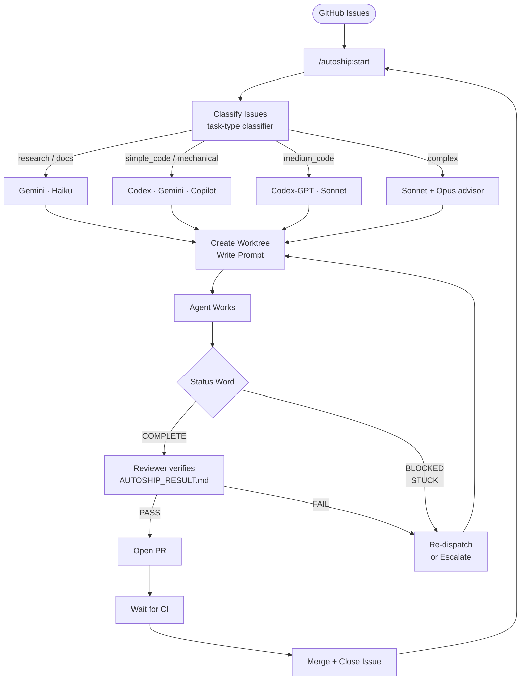
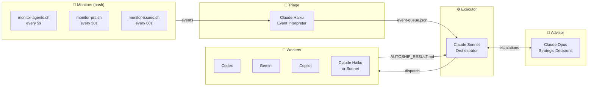

<p align="center">
  
</p>

<p align="center">
  <a href="https://github.com/Maleick/AutoShip/stargazers"></a>
  <a href="https://github.com/Maleick/AutoShip/commits/main"></a>
  <a href="https://github.com/Maleick/AutoShip/releases"></a>
  <a href="LICENSE"></a>
  <a href="https://github.com/Maleick/AutoShip/security"></a>
  <a href="https://github.com/sponsors/Maleick"></a>
</p>

<p align="center">
  <a href="https://github.com/Maleick/AutoShip/wiki">Docs</a> •
  <a href="#before--after">Before/After</a> •
  <a href="#install">Install</a> •
  <a href="#commands">Commands</a> •
  <a href="#how-it-works">How It Works</a> •
  <a href="#dispatch-matrix">Dispatch Matrix</a> •
  <a href="#architecture">Architecture</a> •
  <a href="#benchmarks">Benchmarks</a>
</p>

<p align="center"><strong>Issues in. PRs out. Opus budget: intact.</strong></p>

<p align="center">
  <a href="https://github.com/sponsors/Maleick">☕ Keep the agents running</a>
</p>

---

A [Claude Code](https://docs.anthropic.com/en/docs/claude-code) plugin that autonomously routes GitHub issues to AI agents — Codex, Gemini, Copilot, or Claude — verifies their work, opens pull requests, merges them, and loops back for the next one. One command starts the loop. You watch it ship.

```
┌──────────────────────────────────────────┐
│  ISSUE ROUTING         ████████ AUTO     │
│  AGENT DISPATCH        ████████ AUTO     │
│  PR CREATION           ████████ AUTO     │
│  CI MONITORING         ████████ AUTO     │
│  MERGE + CLOSE         ████████ AUTO     │
│  YOUR EFFORT           █        ~5%      │
└──────────────────────────────────────────┘
```

## Before / After

<table>
<tr>
<td width="50%">

### 📋 Without AutoShip (20 issues)

1. Open GitHub issues backlog
2. Read each issue, estimate complexity
3. Pick an issue manually
4. Open a worktree or branch
5. Write a dispatch prompt from scratch
6. Paste it into Codex / Gemini / Claude
7. Watch the agent, babysit if it gets stuck
8. Review the output yourself
9. Open a PR manually
10. Wait for CI, watch for failures
11. Merge manually
12. Close the issue manually
13. Repeat × 19 more issues

**Time: 3–8 hrs. You did most of it.**

</td>
<td width="50%">

### 🚀 With AutoShip (20 issues)

```
/autoship:start
```

AutoShip reads your open issues, classifies each one (research / docs / simple code / complex), picks the best agent for the job, creates an isolated worktree, dispatches the agent with a focused prompt, verifies the result against acceptance criteria, opens a PR, waits for CI, merges, closes the issue — and immediately starts the next one.

You come back to merged PRs.

**Time: you typed one command.**

</td>
</tr>
</table>

**Same issues. One command. Brain free.**

- **Third-party first** — burns Codex, Gemini, and Copilot quota before touching Claude tokens
- **Parallel workers** — up to 6 issues in flight simultaneously
- **Task-type routing** — classifies issues into 7 categories, routes each to the best agent
- **Live routing config** — edit `AUTOSHIP.md` front matter to change agent priorities, takes effect immediately
- **Verification pipeline** — every result reviewed against acceptance criteria before a PR opens
- **Token ledger** — per-issue and per-session token spend tracked in `.autoship/token-ledger.json`
- **Event-driven** — bash monitors watch agent output, PR CI, and GitHub issues in real time
- **Durable state** — survives restarts via `.autoship/state.json` and GitHub labels

## Install

```bash
claude plugin marketplace add Maleick/AutoShip && claude plugin install autoship@autoship
```

Done. Start a new session and run `/autoship:start`.

### Requirements

- `jq` — JSON processing (`brew install jq`)
- `gh` — GitHub CLI, authenticated (`brew install gh && gh auth login`)
- `tmux` — terminal multiplexer (`brew install tmux`)
- Git repo with a GitHub remote and open issues

### Optional agents (more dispatch power)

| Tool            | What it adds                                                                 | Install                                                   |
| --------------- | ---------------------------------------------------------------------------- | --------------------------------------------------------- |
| `codex`         | OpenAI-powered workers via JSON-RPC app-server (preferred for simple/medium) | [Codex CLI](https://github.com/openai/codex)              |
| `gemini`        | Google-powered workers                                                       | [Gemini CLI](https://github.com/google-gemini/gemini-cli) |
| `gh copilot`    | GitHub Copilot workers                                                       | `gh extension install github/gh-copilot`                  |
| Claude fallback | Always available — no install needed                                         | built-in                                                  |

AutoShip detects available tools at startup and routes work accordingly.

## Commands

| Command            | What it does                                                             |
| ------------------ | ------------------------------------------------------------------------ |
| `/autoship:start`  | Launch orchestration — classify issues, dispatch agents, loop until done |
| `/autoship:plan`   | Dry run — analyze issues and show dispatch plan without executing        |
| `/autoship:stop`   | Gracefully stop all agents, save state, add `autoship:paused` labels       |
| `/autoship:status` | Live dashboard — active agents, quota bars, per-model token spend        |

## How It Works

```
GitHub issue opened
      ↓
Agent tier assigned automatically:
  • Config / YAML / docs   →  Claude Haiku
  • Single-module feature  →  Gemini Flash
  • Docs / README          →  GPT-4o Mini
  • Multi-file / security  →  Claude Sonnet
  • Architecture / advisor →  Claude Opus
      ↓
PR opened, CI runs, branch auto-deleted on merge
      ↓
You review decisions. Not boilerplate.
```



Every agent writes `AUTOSHIP_RESULT.md` and emits `COMPLETE`, `BLOCKED`, or `STUCK` as its final line. AutoShip never trusts conversation output — only the result file.

## Dispatch Matrix

Task type classification drives agent selection. Edit `AUTOSHIP.md` front matter to customize:

| Task Type     | Primary Agent                | Fallback            | Last Resort   |
| ------------- | ---------------------------- | ------------------- | ------------- |
| `research`    | Gemini                       | Claude Haiku        | —             |
| `docs`        | Gemini                       | Claude Haiku        | —             |
| `simple_code` | Codex Spark                  | Gemini · Copilot    | Claude Haiku  |
| `medium_code` | Codex GPT                    | Claude Sonnet       | —             |
| `mechanical`  | Claude Haiku                 | Gemini              | Codex Spark   |
| `ci_fix`      | Claude Haiku                 | Gemini              | —             |
| `complex`     | Claude Sonnet + Opus advisor | Claude Sonnet retry | Opus re-slice |

Quota thresholds gate dispatch: if a tool hits 0% estimated quota, it's skipped and the next in line picks up the work. Quotas are estimated via decay model and reset daily.

<details>
<summary><strong>How Codex dispatch works (no tmux)</strong></summary>

AutoShip drives Codex via `codex app-server` using the JSON-RPC protocol over stdin/stdout FIFOs — no terminal pane required.

```bash
# What happens under the hood:
mkfifo .codex-stdin .codex-stdout
codex app-server < .codex-stdin > .codex-stdout &

# AutoShip sends:
{"jsonrpc":"2.0","method":"initialize",...}
{"jsonrpc":"2.0","method":"thread/start",...}
{"jsonrpc":"2.0","method":"turn/start","params":{"input":[{"type":"text","text":"<issue prompt>"}]}}

# Waits for:
{"method":"turn/completed",...}   # → COMPLETE
{"method":"turn/failed",...}      # → STUCK
{"method":"thread/tokenUsage/updated","params":{"totalTokens":1247}}
```

Token counts from `thread/tokenUsage/updated` events feed directly into the token ledger.

</details>

<details>
<summary><strong>Verification pipeline</strong></summary>

After every agent reports COMPLETE, a dedicated Sonnet reviewer runs:

1. Validates `AUTOSHIP_RESULT.md` exists and passes content check
2. Runs `git diff main...HEAD` to read the actual changes
3. Checks every acceptance criterion against the diff
4. Runs the test suite if one is detected
5. Returns `VERDICT: PASS | FAIL` with confidence level

On FAIL: re-dispatches with failure context appended. After 2 fails: escalates to Sonnet. After 3 fails with Sonnet: spawns Opus advisor to re-slice the issue.

</details>

<details>
<summary><strong>State durability</strong></summary>

AutoShip keeps state in two places simultaneously:

- **`.autoship/state.json`** — local, fast, rebuilt from GitHub labels on restart
- **GitHub labels** — `autoship:queued`, `autoship:in-progress`, `autoship:paused` — durable, visible in the GitHub UI

If you kill the session and restart, `/autoship:start` reads the labels and picks up where it left off.

</details>

## Architecture

Four-tier model: **Bash watches → Haiku thinks → Sonnet orchestrates → Opus advises**



| Tier     | Role                                                  | Model                   |
| -------- | ----------------------------------------------------- | ----------------------- |
| Monitors | 3 bash scripts watching agents, PRs, issues           | bash                    |
| Triage   | Interprets events, categorizes issues, queues actions | Claude Haiku            |
| Executor | Orchestration, dispatch, verification, PR pipeline    | Claude Sonnet           |
| Advisor  | Strategic decisions, UltraPlan, escalations           | Claude Opus             |
| Workers  | Actual code changes                                   | Codex / Gemini / Claude |

### Plugin Structure

```
.claude-plugin/
  plugin.json         ← hooks + metadata
  marketplace.json    ← one-liner install target
hooks/
  activate.sh         ← SessionStart: init + system context injection
  init.sh             ← .autoship/ directory structure
  detect-tools.sh            ← detect Codex/Gemini/Copilot + quota
  monitor-agents.sh          ← watch pane.log for status words (5s)
  monitor-prs.sh             ← watch PR CI + merge status (30s)
  monitor-issues.sh          ← poll GitHub for new/closed issues (60s)
  update-state.sh            ← write issue state + token counts
  cleanup-worktree.sh        ← archive result, remove worktree, close issue
  quota-update.sh            ← decay-based API quota estimation
  classify-issue.sh          ← label issues by task type (7 categories)
  dispatch-codex-appserver.sh← drive Codex via JSON-RPC (no tmux)
  emit-event.sh              ← atomic flock write to event-queue.json
skills/
  orchestrate/             ← orchestration protocol (v3)
  dispatch/           ← agent dispatch (worktree, prompt, third-party first)
  verify/             ← post-completion pipeline (verify, PR, merge)
  status/             ← status dashboard with quota bars
  poll/               ← GitHub issue sync safety net
agents/
  haiku-triage.md     ← event triage agent
  reviewer.md         ← verification reviewer
commands/
  start.md / stop.md / plan.md / status.md / autoship.md
AUTOSHIP.md             ← routing matrix + quota config (YAML front matter, hot-reload)
```

## Benchmarks

Real dispatch results from AutoShip running on its own codebase:

| Issue type          | Agent dispatched | Time to merged PR | Notes                             |
| ------------------- | ---------------- | ----------------- | --------------------------------- |
| Simple bug fix      | Codex Spark      | ~4 min            | JSON-RPC dispatch, no interaction |
| Hook refactor       | Claude Haiku     | ~7 min            | 2 files changed, tests pass       |
| Routing matrix feat | Claude Sonnet    | ~18 min           | AUTOSHIP.md + 3 hooks updated       |
| Token ledger schema | Claude Sonnet    | ~12 min           | New JSON schema + recording logic |
| Emit-event refactor | Claude Haiku     | ~5 min            | 4 files deduplicated              |
| Archival bug fix    | Claude Sonnet    | ~9 min            | Content validation added          |
| **Average**         | —                | **~9 min**        | **issue open → PR merged**        |

> AutoShip shipped all 7 v1.1.0 issues — open to merged PR — in a single session. Zero manual PRs. Zero manual merges.

## Star This Repo

If AutoShip ships issues you didn't have to touch — leave a star. ⭐

[](https://star-history.com/#Maleick/AutoShip&Date)

## License

MIT
