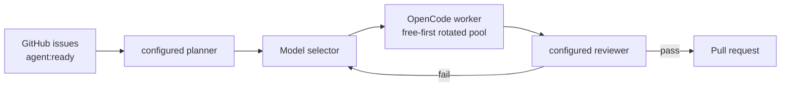
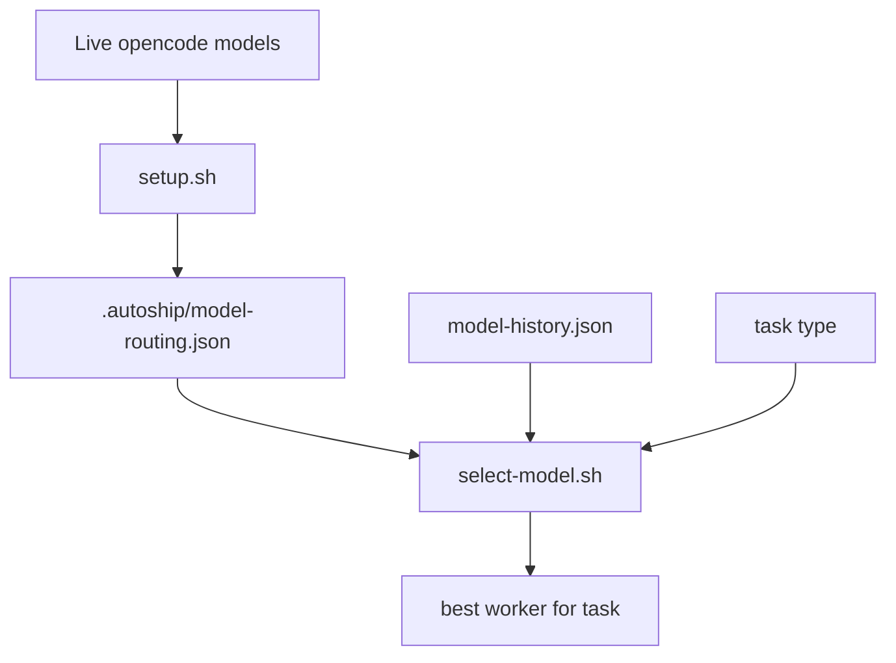

# AutoShip

<p align="center">
  
</p>

<p align="center">
  <a href="https://github.com/Maleick/AutoShip/stargazers"></a>
  <a href="https://github.com/Maleick/AutoShip/commits/main"></a>
  <a href="https://github.com/Maleick/AutoShip/releases"></a>
  <a href="LICENSE"></a>
  <a href="https://autoship.teamoperator.red"></a>
  <a href="https://github.com/sponsors/Maleick"></a>
</p>

<p align="center">
  <a href="https://autoship.teamoperator.red">Docs</a> •
  <a href="https://github.com/Maleick/AutoShip/wiki">Wiki</a> •
  <a href="#commands">Commands</a> •
  <a href="#runtime">Runtime</a> •
  <a href="#local-testing">Testing</a> •
  <a href="https://github.com/sponsors/Maleick">Sponsor</a>
</p>

<p align="center"><strong>Turn backlog into reviewed PRs.</strong></p>

AutoShip is the OpenCode plugin for solo maintainers who want their GitHub issue queue planned, routed, verified, and packaged into pull requests without babysitting every worker.

```text
┌──────────────────────────────────────────┐
│  ISSUE PLANNING        CONFIGURED ROLE   │
│  MODEL SELECTION       LIVE OPENCODE     │
│  WORKER DISPATCH       15 ACTIVE MAX     │
│  REVIEW                CONFIGURED ROLE   │
│  PR CREATION           CONVENTIONAL      │
└──────────────────────────────────────────┘
```

## What It Does

- Reads open GitHub issues labeled `agent:ready`
- Plans work in ascending issue-number order
- Dispatches OpenCode workers up to the configured concurrency cap
- Verifies completed work before PR creation
- Creates PRs with conventional commit titles
- Tracks local state in `.autoship/`

## Installation

Install the CLI globally if you want AutoShip available long-term on your PATH:

```bash
npm install -g opencode-autoship
opencode-autoship install
opencode-autoship doctor
```

For a one-time install without keeping a global CLI, use `bunx` instead:

```bash
bunx opencode-autoship install
bunx opencode-autoship doctor
```

Then start the setup wizard inside OpenCode:

```text
/autoship-setup
```

## Quick Start

```bash
# 1. Install the CLI globally
npm install -g opencode-autoship

# 2. Install AutoShip for OpenCode
opencode-autoship install
opencode-autoship doctor

# 3. Navigate to your project
cd ~/Projects/my-project

# 4. Start AutoShip in OpenCode
/autoship
```

## Runtime

OpenCode is the only supported worker runtime. AutoShip discovers current model availability from:

```bash
opencode models
```

Setup defaults to ranked free worker models from the current OpenCode inventory. On first run, the setup wizard asks which models to use for the orchestrator and reviewer roles; these can be the same model or different models. Operators can explicitly select a comma-separated worker model list with `AUTOSHIP_MODELS`.

The selected routing is saved to `.autoship/model-routing.json`. Edit that file manually to tune model eligibility, strength, or task types. Setup preserves manual edits by default; use `AUTOSHIP_REFRESH_MODELS=1 bash hooks/opencode/setup.sh` to regenerate from the current OpenCode inventory.

AutoShip also loads committed policy profiles from `policies/`. Policies enrich worker prompts, configure Rust cargo safeguards, guide overlap-aware dispatch, and enforce repo-specific hazards such as self-hosted GitHub Actions runners.

## Defaults

- Max active workers: `15`
- Queue ordering: lowest issue number first
- Model routing: ranked free OpenCode models first, with deterministic rotation across compatible workers
- Role selection: best available role model from `opencode models`, preferring free models first, then OpenCode Go models; paid Zen/OpenRouter Kimi models require explicit selection
- Free detection: `:free`/`-free` IDs and bundled free Zen models such as `opencode/big-pickle` and `opencode/gpt-5-nano`
- Go routing: `opencode-go/*` models are included as low-cost subscription fallback models, not free models
- Orchestrator/reviewer: prompted during first-run setup and configurable independently
- Worker selection: free-first compatible model per task, with selected fallbacks eligible when configured
- Complex fallback: if no sufficiently strong compatible worker is available, AutoShip uses the configured orchestrator model as an advisor

## How It Works





## Commands

| Command | Purpose |
| --- | --- |
| `/autoship` | Start orchestration |
| `/autoship-plan` | Show ascending issue plan |
| `/autoship-status` | Show runtime state and workspace statuses |
| `/autoship-setup` | Discover OpenCode models and choose routing |
| `/autoship-stop` | Stop orchestration |
| `/autoship-audit` | Detect GitHub/local state drift |
| `/autoship-dashboard` | Show throughput, cadence, and model metrics |
| `/autoship-apply` | Apply a proposed workspace by creating its PR |
| `/autoship-retry` | Requeue a blocked or stuck issue |
| `/autoship-cancel` | Cancel an issue workspace |
| `/autoship-clean` | Remove terminal workspaces |

## Key Hooks

| Hook | Purpose |
| --- | --- |
| `hooks/opencode/setup.sh` | Discover live OpenCode models and write `.autoship/model-routing.json` |
| `hooks/opencode/plan-issues.sh` | Build ascending issue plan |
| `hooks/opencode/dispatch.sh` | Create worktree, prompt, model assignment, and queued status |
| `hooks/opencode/runner.sh` | Start queued workspaces up to the concurrency cap |
| `hooks/opencode/status.sh` | Summarize active, queued, completed, blocked, and stuck work |
| `hooks/opencode/check.sh` | Run syntax, policy, smoke, shellcheck, and shfmt checks |
| `hooks/opencode/audit.sh` | Compare GitHub state with local AutoShip state |
| `hooks/opencode/monitor-ci.sh` | Monitor opened PR CI status |
| `hooks/opencode/auto-merge.sh` | Merge PRs labeled `autoship:auto-merge` after CI passes |
| `hooks/opencode/reconcile-state.sh` | Reconcile workspace status files back into state |
| `hooks/opencode/pr-title.sh` | Generate conventional PR titles |

## Local Testing

```bash
bash hooks/opencode/test-policy.sh
bash -n hooks/opencode/*.sh hooks/*.sh
bash hooks/opencode/smoke-test.sh
```

## Release

Package publish steps are documented in [`docs/RELEASE.md`](docs/RELEASE.md).

## Troubleshooting

Run diagnostics first:

```bash
opencode-autoship doctor
```

If checks fail, reinstall the package assets and rerun setup:

```bash
opencode-autoship install
```

```text
/autoship-setup
```

## Runtime Artifacts

`.autoship/` contains local runtime state and workspaces. Do not commit it.
